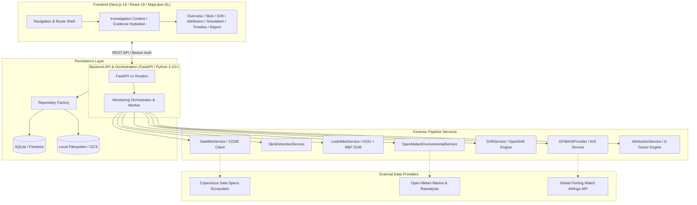

# Aquila

An AI-assisted maritime forensic intelligence platform for satellite-based oil slick detection, reverse drift reconstruction, and vessel attribution.

---

## Overview

Marine oil pollution often occurs in open waters without immediate observation, making timely detection and source identification challenging. Aquila provides a structured, multi-stage forensic investigation pipeline that ingests satellite Synthetic Aperture Radar (SAR) imagery, detects surface oil slicks, classifies potential look-alikes using machine learning, models oceanographic drift backwards in time, and correlates plausible release areas with maritime vessel activity.

The investigation pipeline propagates evidentiary data across sequential stages:

```
Satellite SAR Imagery
       │
       ▼
Scene Ingestion & Preprocessing
       │
       ▼
Dark Anomaly / Slick Detection
       │
       ▼
Look-Alike ML Classification (HOG + RBF SVM)
       │
       ▼
Environmental Forcing (Wind & Ocean Currents)
       │
       ▼
OpenDrift Numerical Reverse Hindcast
       │
       ▼
AIS Vessel Presence & Identity Discovery
       │
       ▼
Six-Factor Heuristic Attribution
       │
       ▼
Auditable Evidence Timeline & Forensic Report
```

---

## Key Capabilities

- **Sentinel-1 SAR Scene Ingestion & Preprocessing:** Ingests Copernicus Sentinel-1 C-band SAR Level-1 Ground Range Detected (GRD) products via Copernicus Data Space Ecosystem (CDSE) APIs or local archives, calibrating and standardizing dual-polarization rasters.
- **Slick Anomaly Detection:** Applies spatial thresholding, morphological filtering, and contour extraction to detect low-backscatter surface anomalies and extract polygon geometries, centroids, and surface areas.
- **Look-Alike Classification:** Uses a Histogram of Oriented Gradients (HOG) feature extractor and an RBF Support Vector Machine (SVM) trained on derived Sentinel-1 data to assess whether detected anomalies exhibit oil-like characteristics or natural look-alikes.
- **Atmospheric & Oceanographic Forcing:** Retrieves historical and near-real-time environmental forcing data (ECMWF ERA5 wind vectors and CMEMS ocean current velocities) via the Open-Meteo API.
- **Numerical Reverse Hindcast (OpenDrift):** Executes backward-in-time Lagrangian particle tracking with OpenDrift (`OceanDrift` model) to simulate slick drift over a 24-hour window and derive a convex-hull Plausible Release Region.
- **AIS Vessel Discovery:** Queries Global Fishing Watch (GFW) APIs for vessel presence, track segments, and identities intersecting the spatiotemporal release window.
- **Six-Factor Heuristic Attribution:** Evaluates candidate vessels against six explainable criteria: Spatial Compatibility, Temporal Compatibility, Trajectory Compatibility, Drift Compatibility, Behavioural Evidence, and AIS Data Quality.
- **Structured Evidence Ledger:** Persists each pipeline stage as an immutable evidence event with structured JSON observations, provider provenance, and execution timestamps.
- **Interactive Investigation Dashboard:** A Next.js frontend that visualizes SAR imagery, candidate polygons, particle trajectories, vessel tracks, evidence timelines, and downloadable forensic reports.

---

## Architecture



---

## Investigation Workflow

1. **Investigation Initiation:** An investigation is opened manually (specifying an AOI bounding box or explicit Sentinel-1 scene ID) or automatically by the monitoring orchestrator upon detecting newly cataloged SAR scenes.
2. **Satellite Scene Ingestion:** `SatelliteService` retrieves or loads the Sentinel-1 GRD product, runs radiometric preprocessing, persists the scene record in `SceneRepository`, and records a `SATELLITE_ACQUISITION` evidence event.
3. **Candidate Slick Detection:** `SlickDetectionService` parses the preprocessed SAR GeoTIFF, identifies low-intensity backscatter regions, extracts polygon boundaries, calculates surface area in square kilometers (`area_sq_km`) and centroid coordinates, and attaches a `SLICK_CANDIDATE` evidence event.
4. **ML Look-Alike Classification:** `LookAlikeService` extracts sub-patches centered on candidate centroids, normalizes pixel intensities, computes HOG feature descriptors, and evaluates the RBF SVM model (`lookalike_svm_real_v1`), outputting `OIL_LIKE`, `LOOKALIKE`, or `UNCERTAIN` along with decision-boundary margins into a `SATELLITE_CLASSIFICATION` event.
5. **Environmental Data Retrieval:** `OpenMeteoEnvironmentalService` fetches hourly 10-meter wind vectors (ECMWF ERA5) and surface current velocities (Copernicus Marine Service) for the incident coordinates and timestamp, creating an `ENVIRONMENTAL_OBSERVATION` event.
6. **OpenDrift Numerical Hindcast:** `DriftService` configures a 24-hour backward Lagrangian simulation using OpenDrift's `OceanDrift` model forced by the retrieved environmental vectors, computing particle trajectories and a convex-hull envelope representing the Plausible Release Region, recorded in a `DRIFT_HINDCAST` event.
7. **AIS Vessel Discovery:** `GFWAISProvider` queries the Global Fishing Watch 4Wings presence API across the spatiotemporal release window, mapping any recorded MMSI vessels and attaching an `AIS_PRESENCE` evidence event.
8. **Six-Factor Heuristic Attribution:** `AttributionService` evaluates candidates against spatial, temporal, trajectory, drift, behavioural, and data quality criteria, outputting compatibility ratings to an `ATTRIBUTION_EVALUATION` event.
9. **Timeline & Report Generation:** The investigation status transitions to `REPORT_READY`. The complete evidence ledger is assembled into an auditable timeline and formatted as a forensic investigation report.

---

## Technical Stack

| Layer | Technologies | Description |
|---|---|---|
| **Frontend** | Next.js 16.3.3, React 19, TypeScript 5, Tailwind CSS 4 | App Router frontend with real-time evidence hydration |
| **Mapping & Geospatial UI** | MapLibre GL 6.6.0 | Interactive SAR rasters, polygon overlays, and particle trajectories |
| **Backend Framework** | FastAPI 0.100+, Uvicorn, Pydantic v2 | High-performance asynchronous REST API with typed schemas |
| **Scientific Computing** | OpenDrift 1.14+, NumPy, SciPy, xarray, netCDF4 | Lagrangian ocean drift modeling and multidimensional array analysis |
| **Geospatial Processing** | Rasterio 1.3+, GeoPandas 0.14+, Shapely 2.0+, GDAL | SAR raster I/O, polygon geometry calculations, and projection handling |
| **Machine Learning** | scikit-learn 1.3+, scikit-image 0.22+, Joblib, Pillow | HOG feature extraction and RBF SVM look-alike inference |
| **Database & Storage** | SQLite 3 (default), Cloud Firestore (optional), Local File Storage / GCS | ACID-compliant metadata storage, evidence event ledger, and raster cache |
| **External Providers** | Copernicus Data Space Ecosystem (CDSE), Open-Meteo, Global Fishing Watch (GFW) | Satellite catalog, marine weather forcing, and AIS vessel presence |
| **Testing & Quality** | Pytest 9.1+, AnyIO, HTTPX | Comprehensive integration and regression test suite |

---

## Evidence Model

Aquila organizes all analytical findings as structured, immutable `EvidenceEvent` records attached to each investigation. The frontend context dynamically reconstructs the investigation state from these events:

| Evidence Event Type | Producing Service | Primary Metadata & Observations |
|---|---|---|
| `SATELLITE_ACQUISITION` | `SatelliteService` | Product ID, mission, acquisition timestamp, bounding box, polarization, storage path |
| `SLICK_CANDIDATE` | `SlickDetectionService` | Candidate ID, polygon GeoJSON, centroid coordinates, computed area (`area_sq_km`), status |
| `SATELLITE_CLASSIFICATION` | `LookAlikeService` | Predicted class (`OIL_LIKE`, `LOOKALIKE`, `UNCERTAIN`), raw SVM decision score, model version, margin |
| `ENVIRONMENTAL_OBSERVATION` | `OpenMeteoEnvironmentalService` | Wind speed/direction (ECMWF), current speed/direction (CMEMS), timestamp, provider |
| `DRIFT_HINDCAST` | `DriftService` | 24h reverse waypoints, origin polygon (Plausible Release Region), particle count, engine provenance |
| `AIS_PRESENCE` | `GFWAISProvider` | Vessel count, candidate identities, MMSIs, search window, provider boundary status |
| `ATTRIBUTION_EVALUATION` | `AttributionService` | Six-factor compatibility evaluations, factor observations, limitations, candidate ranks |

---

## AIS Data & Limitations

Aquila integrates with the **Global Fishing Watch (GFW) 4Wings API v3** (`public-global-presence:latest` dataset). To ensure scientific rigor, the system adheres to strict evidentiary rules:

- **Aggregated Presence Data:** GFW provides hourly aggregated presence records rather than continuous high-frequency AIS tracks. The platform reflects this data fidelity truthfully.
- **Dataset Temporal Boundary:** The public GFW presence dataset has an availability boundary (historically aligned around mid-September 2026 for public testing snapshots). When an investigation's release window falls outside this coverage:
  - The pipeline logs `status = NO_CANDIDATES` rather than failing or fabricating candidate records.
  - The evidence event explicitly documents the temporal boundary limitation.
  - **Critical Principle:** `NO_CANDIDATES` indicates that no vessel records were returned within available provider data; it does **not** assert that no vessels were present in the physical area.
- **Provider Modes:**
  - `LIVE`: Live HTTP queries to the Global Fishing Watch API gateway.
  - `DEMO_MOCK`: Offline demonstration data for testing algorithmic attribution logic without live API dependencies.
  - `BYOD` (Bring Your Own Data): Allows operators to upload external AIS CSV/JSON tracks for custom attribution.

---

## Machine Learning

The Look-Alike assessment component evaluates whether dark SAR candidates are consistent with mineral oil or biogenic/meteorological look-alikes (e.g., low wind areas, natural sea slicks):

- **Architecture:** Histogram of Oriented Gradients (HOG) combined with a Radial Basis Function Support Vector Machine (RBF SVM).
- **Feature Pipeline:**
  1. Patch extraction centered on slick centroid (with zero-padding near raster boundaries).
  2. Grayscale intensity normalization and resizing to $128 \times 128$.
  3. HOG extraction using 9 orientations, $32 \times 32$ pixels per cell, and $2 \times 2$ cells per block.
- **Model Artifact:** `lookalike_svm_real_v1.joblib` (anchored to `backend/data/models/`).
- **Provenance:** `REAL_DATA_TRAINED` (trained on derived Sentinel-1 SAR imagery).
- **Inference Classes:**
  - `OIL_LIKE`: Decision function score above positive uncertainty margin.
  - `LOOKALIKE`: Decision function score below negative uncertainty margin.
  - `UNCERTAIN`: Decision function score within the uncertainty band ($[-0.30, +0.30]$), indicating ambiguity requiring downstream evidence.

---

## Drift Reconstruction

Drift reconstruction establishes the probable historical release location of a surface slick:

- **Engine:** OpenDrift (`OceanDrift` module, version 1.14.12), an open-source Lagrangian ocean trajectory framework.
- **Simulation Mode:** 24-hour backward numerical hindcast (`timestep = -3600s`).
- **Environmental Forcing:** Spatiotemporally aligned wind vectors (ECMWF ERA5) and ocean current fields (Copernicus Marine Service) fetched live via Open-Meteo.
- **Particle Dynamics:** Injects particles across the detected slick polygon, back-propagating positions under the influence of current advection and wind leeway.
- **Plausible Release Region:** Computes a convex hull envelope enclosing the back-propagated particle ensemble at $t - 24\text{h}$. The system explicitly labels this as a *Plausible Release Region*, noting that convex hulls represent geometric envelopes rather than exact point sources.

---

## Frontend

The frontend is a responsive Next.js web application built with Tailwind CSS and MapLibre GL:

- **Investigation Overview (`/investigation/[id]`):** Core status banner (`REPORT_READY`, `INCOMPLETE`, `OPEN`), incident summary, AOI coordinates, and quick metrics.
- **Slick Assessment (`/investigation/[id]/slick-assessment`):** High-resolution SAR scene visualization, detected slick polygon overlay, centroid coordinates, surface area ($0.10\text{ km}^2$), and ML classification metadata.
- **Origin & Drift (`/investigation/[id]/drift-reconstruction`):** MapLibre map rendering backward trajectory waypoints, the Plausible Release Region polygon, and atmospheric/oceanic forcing vectors.
- **Vessel Attribution (`/investigation/[id]/vessel-attribution`):** Candidate vessel listings, provider provenance, coverage notes, and 6-factor breakdown.
- **Simulation (`/investigation/[id]/simulation`):** Counterfactual forward simulation controls to test hypothetical drift trajectories under varied environmental scenarios.
- **Timeline (`/investigation/[id]/timeline`):** Chronological ledger displaying all persisted evidence events from satellite acquisition to final attribution.
- **Report (`/investigation/[id]/report`):** Formal forensic investigation report summarizing findings, evidence provenance, and technical disclaimers.

---

## Backend API

The FastAPI service exposes modular REST endpoints documented under OpenAPI (`/docs`):

### Investigations (`/api/v1/investigations`)
- `POST /manual` — Creates and executes an end-to-end investigation for a given AOI or Sentinel-1 scene ID.
- `GET /` — Lists historical investigations with filtering by status and creation mode.
- `GET /{id}` — Retrieves investigation details, status, source product ID, and anomaly metadata.
- `GET /{id}/evidence` — Returns the ordered, immutable evidence events attached to an investigation.
- `PATCH /{id}` — Updates investigation status and notes.

### Scientific Services
- `GET /api/v1/satellite/scenes` — Lists ingested Sentinel-1 SAR scenes.
- `POST /api/v1/satellite/ingest` — Ingests and calibrates a SAR product from CDSE or local disk.
- `POST /api/v1/analysis/detect` — Runs dark anomaly detection on a processed SAR raster.
- `POST /api/v1/analysis/classify` — Evaluates the HOG + RBF SVM model against a candidate patch.
- `POST /api/v1/drift/hindcast` — Triggers an OpenDrift 24-hour backward trajectory simulation.
- `POST /api/v1/ais/query` — Queries GFW vessel presence records across a spatiotemporal window.
- `POST /api/v1/attribution/evaluate` — Evaluates candidate vessels using the Six-Factor Attribution model.
- `POST /api/v1/simulation/counterfactual` — Runs forward counterfactual drift simulations.
- `GET /api/v1/reports` — Lists compiled forensic reports.

### System & Health
- `GET /health` — Liveness check.
- `GET /readiness` — Readiness evaluation checking CDSE credentials, ML model availability, and database connectivity.

---

## Local Development

### Prerequisites
- Python 3.10 or higher
- Node.js 18 or higher (with `npm`)
- System libraries: GDAL, PROJ, GEOS (required for rasterio and shapely)

### 1. Backend Setup
```bash
cd backend

# Create and activate virtual environment
python3 -m venv venv
source venv/bin/activate

# Install dependencies
pip install -r requirements.txt

# Run database migrations / initialization
python -c "from app.services.repositories.db import initialize_db; initialize_db()"

# Start the FastAPI server
uvicorn app.main:app --host 0.0.0.0 --port 8000 --reload
```

### 2. Frontend Setup
```bash
cd aquila-frontend

# Install dependencies
npm install

# Start the Next.js development server
npm run dev -- -p 3000
```

### 3. Environment Configuration
Create a `.env` file in the `backend/` directory if connecting to live external providers:
```ini
# Core Configuration
PROJECT_NAME="AQUILA Scientific Engine"
PERSISTENCE_BACKEND="sqlite"
ARTIFACT_STORAGE_BACKEND="local"
CORS_ALLOWED_ORIGINS="http://localhost:3000,http://127.0.0.1:3000"

# Environmental Provider (LIVE_OPEN_METEO or DEMO_MOCK)
ENVIRONMENTAL_PROVIDER="LIVE_OPEN_METEO"

# Copernicus Data Space Ecosystem (CDSE) Credentials (Optional for live catalog search)
CDSE_CLIENT_ID=""
CDSE_CLIENT_SECRET=""

# Global Fishing Watch (GFW) API Token (Optional for live AIS queries)
GFW_API_TOKEN=""
```

---

## Testing

The codebase maintains automated test suites across backend and frontend:

### Backend Pytest Suite
```bash
cd backend
./venv/bin/pytest
```
**Verified Result:**
```
================ 155 passed, 11 skipped, 0 failed in 34.73s =================
```

### Frontend Production Build
```bash
cd aquila-frontend
npm run build
```
**Verified Result:**
```
✓ Compiled successfully
✓ Finished TypeScript validation (0 errors)
✓ Generated static & dynamic routes (9/9)
```

---

## Example Investigation

### Investigation ID: `INV-2026-5D5DC89D`

This investigation serves as the primary verification baseline for the end-to-end pipeline:

- **Status:** `REPORT_READY`
- **Source SAR Scene:** `local-scene-1789041909` (Sentinel-1 C-band SAR GRD, processed GeoTIFF)
- **Detected Candidate:** `cand-110e9d3d193c`
  - **Surface Area:** $0.1008\text{ km}^2$
  - **Centroid Coordinates:** $[58.0257^\circ\text{E}, 24.4744^\circ\text{N}]$
- **Look-Alike Classification:**
  - **Predicted Class:** `UNCERTAIN`
  - **Raw SVM Score:** $-0.0957$ (within $[-0.30, +0.30]$ margin)
  - **Model:** `HOG + RBF SVM` (`lookalike_svm_real_v1`, `REAL_DATA_TRAINED`)
- **Environmental Forcing (Open-Meteo):**
  - **Wind:** $2.72\text{ m/s}$ ($5.3\text{ knots}$) @ $175^\circ$
  - **Ocean Current:** $0.06\text{ m/s}$ @ $225^\circ$
- **OpenDrift Numerical Hindcast:**
  - **Engine:** OpenDrift 1.14.12 (`OceanDrift`, 1000 particles)
  - **Simulation:** 24-hour backward trajectory (25 hourly waypoints)
  - **Plausible Release Region:** Enclosing polygon derived from particle dispersion envelope
- **AIS Vessel Presence (Global Fishing Watch):**
  - **Provider:** Global Fishing Watch 4Wings API v3
  - **Mode:** `LIVE`
  - **Status:** `NO_CANDIDATES`
  - **Limitation Note:** The incident timestamp exceeds the GFW public dataset boundary (`2026-09-13`). Zero candidates were returned due to provider temporal coverage limits, not because vessel presence was disproven.
- **Attribution Evaluation:**
  - **Methodology:** Six-Factor Evidence-Weighted Model
  - **Status:** `NO_CANDIDATES` (evaluated with upstream AIS limitations noted)

---

## Repository Structure

```
Aquila/
├── README.md
├── pytest.ini
├── aquila-frontend/                 # Next.js frontend application
│   ├── package.json
│   ├── tsconfig.json
│   ├── next.config.ts
│   └── src/
│       ├── app/                     # App router pages
│       │   ├── investigation/       # Investigation views (slick, drift, ais, report)
│       │   ├── monitoring/          # Automated monitoring zone views
│       │   ├── reports/             # Forensic report archives
│       │   └── vessels/             # Vessel track and fleet views
│       ├── components/              # Shared UI components
│       ├── contexts/                # State management (InvestigationContext, AuthContext)
│       └── lib/                     # API client and Firebase configuration
├── backend/                         # FastAPI backend service
│   ├── requirements.txt
│   ├── repair_pipeline.py           # Idempotent investigation repair script
│   ├── app/
│   │   ├── main.py                  # Application entrypoint and lifespan hooks
│   │   ├── api/                     # REST routers (v1 endpoints & dependencies)
│   │   ├── core/                    # Settings, worker, and logging configurations
│   │   ├── schemas/                 # Pydantic data contracts (investigation, evidence, drift, ais)
│   │   └── services/                # Pipeline domain services
│   │       ├── cdse_service.py      # Copernicus Data Space client
│   │       ├── satellite_service.py # SAR calibration & preprocessing
│   │       ├── slick_detection_service.py
│   │       ├── look_alike_service.py# HOG + SVM inference
│   │       ├── open_meteo_service.py# ERA5 & CMEMS forcing
│   │       ├── drift_service.py     # OpenDrift integration
│   │       ├── gfw_ais_provider.py  # Global Fishing Watch client
│   │       ├── attribution_service.py # Six-factor heuristic model
│   │       ├── orchestrator.py      # Automated pipeline orchestrator
│   │       └── repositories/        # SQLite & Firestore persistence abstractions
│   ├── data/
│   │   ├── aquila.db                # SQLite database
│   │   ├── models/                  # Trained ML model artifacts
│   │   └── scenes/                  # Processed SAR GeoTIFF files
│   └── tests/                       # Pytest test suite (155 tests)
└── docs/                            # Architecture and hardening documentation
```

---

## Project Status

**Aquila is a completed and frozen project.**

The current implementation has been verified end-to-end and is no longer under active feature development.

---

## Disclaimer & Data Limitations

1. **Analytical Evidence:** Outputs produced by Aquila—including slick detection polygons, ML classifications, hindcast trajectories, and attribution scores—are computational indicators intended to support maritime forensic investigations. They do not constitute sole legal proof of liability.
2. **AIS Provider Limitations:** Global Fishing Watch public presence datasets have geographic and temporal coverage limits (including the known public temporal boundary around September 2026). The absence of AIS candidate records in an area or timeframe does not establish that no vessels operated in that region.
3. **Simulation Assumptions:** Numerical drift hindcasts produced by OpenDrift depend directly on the spatial and temporal resolution of the underlying atmospheric and oceanographic models (ECMWF ERA5 and CMEMS). Local sub-mesoscale currents and coastal boundary effects may introduce positional variance.

---

## Author

**Om Gangwar**  
GitHub: [@omrxjpxt](https://github.com/omrxjpxt)  
Email: `gangwarom973@gmail.com`  
Repository: [https://github.com/omrxjpxt/Aquila](https://github.com/omrxjpxt/Aquila)
